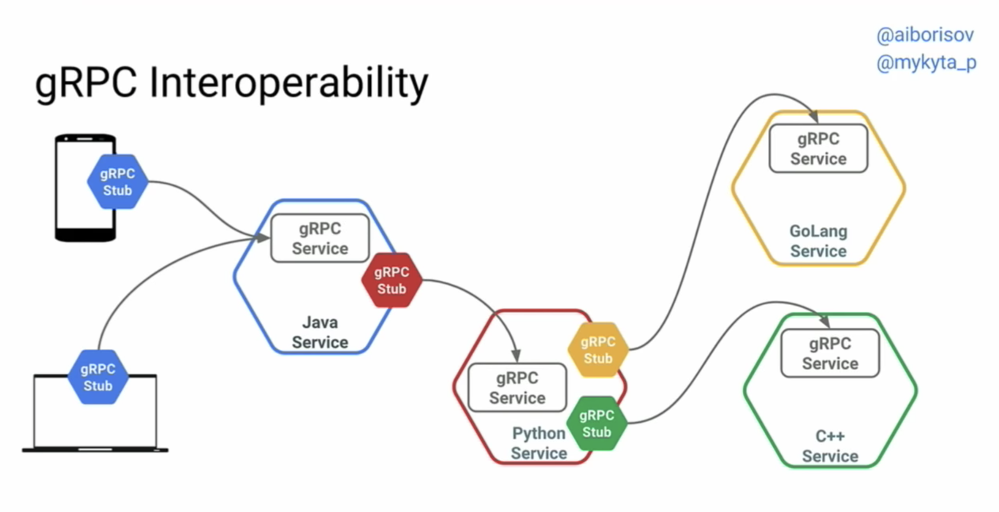

# Microservices and gRPC - 101

Most microservices-based solutions architecture usually care about the following standards:
- Built in different languages
- Isolating a unit or function of a business
- Microservices should agree:
  - API to exchange data
  - Data format and model (JSON, Binary, XML?)
  - Endpoints specification 

And at a production scale those microservices should support:
- Load balancing
- Tracing
- Health checking
- Auth
- Logging
- Low Latency
- Scalability
- Languages interoperability (the teams' autonomy over tech stack)

> Today's weapon of choice: RESTful API (HTTP-JSON)`

## API is a contract

    - Send me this REQUEST (Client, Stub in gRPC)
    - I'll send you this RESPONSE (Server)

### It's all about the data

## RPC in a nutshell
An RPC call happens **over the network**,this call may it look like this:

#### Client

```javascript
// code
server.CreateUser(user)
// more code
```

#### Server

```python 
def create_user(user: User) { 
    # code that creates the user
    ...  
}
```

## gRPC to the rescue.

### Overview
- FOSS by Google
- CNCF, like Docker and Kubernetes
- TLS based security
- Simple service definition
- Have these main implementations:
  - gRPC-Java
  - gRPC-Go
  - gRPC-C
    - gRPC C++
    - gRPC-Python
    - gRPC-Objective C
    - gRPC-PHP
    


- Keeps data in binary both in client memory and on the wire by building on **HTTP/2** and **Protocol Buffers**
- Efficiently connecting and generating polyglot services code in microservices style architecture with a simple `.proto` file
- Allows to define **`REQUEST`** and **`RESPONSE`** for RPC and handles the heavy lifting (auth, logging, LB, monitoring)



- Fast and efficient, low latency
- Supports **bi-directional streaming** and integrated auth
- Production-grade services at Netflix, Square, Cockroach Labs and Cisco
- Active and responsive team/community

### Protocol Buffers
It is an open source mechanism for serializing structured data. We use it to define **Messsages** (data, **`REQUEST`** and **`RESPONSE`**) and **Service** (Service name and RPC endpoints)

Some beneficts of its efficency: 
- Smaller payload size means saving in Network Bandwith
- Parsing is less CPU intensive

```grpc
message Student {
  required string name = 1;
  required int32 id = 2;
  optional string email = 3;

  enum PhoneType {
    MOBILE = 0;
    HOME = 1;
    WORK = 2;
  }

  message PhoneNumber {
    required string number = 1;
    optional PhoneType type = 2 [default = HOME];
  }

  repeated PhoneNumber phone = 4;
}
```

https://grpc.io/docs/guides/
https://developers.google.com/protocol-buffers/docs/overview

## Python
https://grpc.io/docs/quickstart/python/
